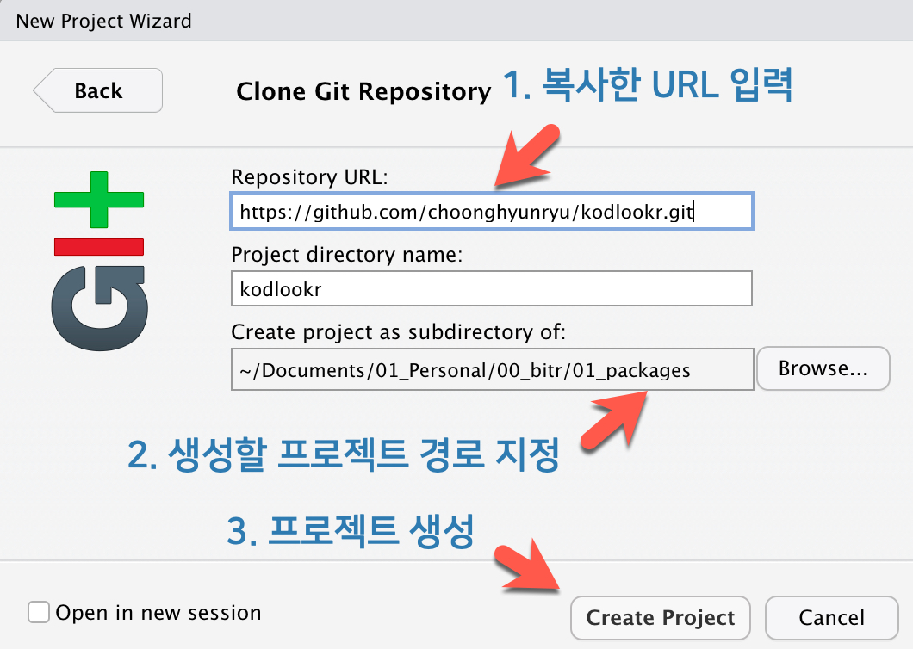
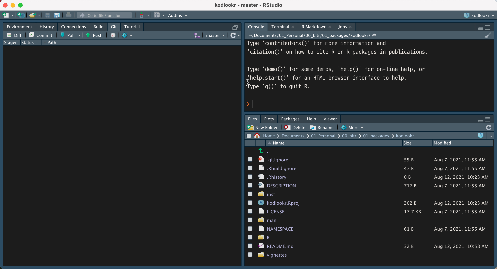

```{r setup, include=FALSE}
options(htmltools.dir.version = FALSE)
```

```{r xaringan-themer, include=FALSE, warning=FALSE}
library(xaringanthemer)
style_duo_accent(
  primary_color = "#1381B0",
  secondary_color = "#FF961C",
  inverse_header_color = "#FFFFFF"
)
```

background-image: url(https://choonghyunryu.github.io/dlookr/figures/detective_2.png)

---
class: inverse, middle, center

# dlookr 패키지의 이해

---
background-image: url(images/detective_2.png)
background-size: 100px
background-position: 90% 5%

# about dlookr

데이터 진단, 데이터 탐색(EDA) 및 변수의 변환 기능을 제공하는 R 패키지

- CRAN : https://cran.r-project.org/web/packages/dlookr/
- Github : https://github.com/choonghyunryu/dlookr

<p align="center"></p>

---
background-image: url(images/detective_2.png)
background-size: 100px
background-position: 90% 5%

# about dlookr

CRAN Task View의 **Missing Data section** 섹션에 포함

- CRAN Task View : https://cran.r-project.org/web/views/MissingData.html

<p align="center"></p>

---
background-image: url(images/detective_2.png)
background-size: 100px
background-position: 90% 5%

# dlookr 기능

데이터 진단, 데이터 탐색(EDA) 및 변수의 변환 

- tidyverse 패키지와의 궁합
- 개별 분석 기능과 자동화 리포트 기능

<p align="center"></p>

---
background-image: url(images/detective_2.png)
background-size: 100px
background-position: 90% 5%

# dlookr 기능

dlookr 사용 예시  

- 개별 함수를 이용한 데이터 분석 사례

<p align="center"></p>

---
background-image: url(images/detective_2.png)
background-size: 100px
background-position: 90% 5%

# dlookr 기능

다이나믹 리포트 자동화

- 데이터 진단, 데이터 탐색, 변수변환의 보고서 3종 
- 보고서 내에서 메뉴를 통해서 인터랙티브하게 데이터 분석 수행

<p align="center"></p>

---
background-image: url(images/detective_2.png)
background-size: 100px
background-position: 90% 5%

# dlookr 기능

정적 리포트 자동화

- 데이터 진단, 데이터 탐색, 변수변환의 보고서 3종 

<p align="center"></p>


---
background-image: url(images/detective_2.png)
background-size: 100px
background-position: 90% 5%

# dlookr documentations

Package Down에 Vignettes과 도움말 게시

- Package Down : https://choonghyunryu.github.io/dlookr/

<p align="center"></p>

---
background-image: url(images/detective_2.png)
background-size: 100px
background-position: 90% 5%

# dlookr documentations

Vignettes 3종 (Diagnose Data, EDA, Data Transformation)  

- browseVignettes("dlookr") 명령어로 브라우징  

<p align="center"></p>

---
background-image: url(images/detective_2.png)
background-size: 100px
background-position: 90% 5%

# dlookr documentations

dlookr 도움말  

- help("dlookr"), 혹은 ? dlookr 명령어로 브라우징

<p align="center"></p>

---
class: inverse, middle, center

# kodlookr 패키지 개발하기 

---
background-image: url(images/kodlookr.png)
background-size: 100px
background-position: 90% 5%

# about kodlookr

kodlookr은 한국인이 dlookr 패키지를 쉽게 사용할 수 있도록, 도움말 자료를 한글화한 패키지   

<p align="center"></p>

---
background-image: url(images/kodlookr.png)
background-size: 100px
background-position: 90% 5%

# about kodlookr

- kodlookr 패키지의 기능 및 범위
    + 도움말 136종 (일부 중복 포함) 한글화
    + Vignettes 3종 한글화
    
<p align="center"></p>

---
background-image: url(images/kodlookr.png)
background-size: 100px
background-position: 90% 5%

# prepared resources

- kodlookr 패키지의 skeleton 개발 완료
- URL : https://github.com/bit2r/kodlookr
    
<p align="center"></p>

---
background-image: url(images/kodlookr.png)
background-size: 100px
background-position: 90% 5%

# your turns

- 도움말과 Vignettes 한글화
- 패키지 hex 로고 디자인
- 그 밖에 여러분의 참신한 아이디어 구현
- 그리고 패키지 저자로 등재
    
<p align="center"></p>

---
class: inverse, center, middle

# RStudio에서 Github의 kodlookr 패키지 연동

---

# kodlookr 리파지토리 Fork하기

https://github.com/bit2r/kodlookr를 자신의 계정으로 Fork하기

<p align="center"></p>

---

# 리파지토리 URL 복사하기

개인 리파지토리에서 kodlookr 패키지 URL 얻기:

- Code 메뉴를 클릭한 후 Clone web URL 선택하여 URL을 클립보드에 복사한다.

<p align="center"></p>

---

# Github 연동 프로젝트 생성 

RSudio에서 Github의 리파지토리와 연동할 프로젝트 생성:

- 메뉴로부터 프로젝트 생성 `File -> New Project...`

<p align="center"></p>

---

# Github 연동 프로젝트 생성 

RSudio에서 Github의 리파지토리와 연동할 프로젝트 생성:

- New Project Wizard의 `Create Project -> Version Control`

<p align="center"></p>

---

# Github 연동 프로젝트 생성 

RSudio에서 Github의 리파지토리와 연동할 프로젝트 생성:

- New Project Wizard의 `Create Project from Version Control -> Git`

<p align="center"></p>

---

# Github 연동 프로젝트 생성 

RSudio에서 Github의 리파지토리와 연동할 프로젝트 생성:

- New Project Wizard의 `Clone Git Repository -> 복사한 리파지토리 URL 입력`

- **프로젝트 생성 경로에 절대로 한글을 포함해서는 안된다.**, 연동문제 발생  

<p align="center"></p>

---

# Github 연동 프로젝트 생성 

연동된 프로젝트의 초기 화면 :

- **DESCRIPTION**, **NAMESPACE**와 **man**, **R**, **vignettes** 폴더가 보인다. 

<p align="center"></p>

---
class: inverse, center, middle

# R 패키지 이해 및 kodlookr 개발

---

# R 패키지의 대표적인 구성

- DESCRIPTION : 패키지를 정의하는 여러 정보를 담는 메타파일
- NAMESPACE : 패키지가 참조하는 종속된 타 패키지와 함수의 import 정보 및 패키지가 구현한 기능의 export 정보
- R : 패키지를 구현한 소스를 담은 폴더 
- man : 패키지의 도움말을 담은 폴더 
- vignettes : 패키지의 vignettes를 담은 폴더 

<p align="center"></p>

---

# DESCRIPTION
패키지를 정의하는 여러 정보를 담는 메타파일

- 패키지 이름, 설명, 버전 정보 기술
- 종속된 패키지 기술 
- 저자 및 라이센스 정보 기술

<p align="center"></p>

---

# NAMESPACE
패키지의 종속성을 정의하는 메타파일

- import
    + 패키지에서 참조하는 타 패키지 정의
- importForm
    + 패키지에서 참조하는 타 패키지의 함수나 메소드
- export
    + 패키지에서 정의한 함수로 패키지 사용자가 사용할 수 있도록 내보내기 정의
- S3method
    + S3 메소드로 패키지 사용자가 사용할 수 있도록 내보내기 정의

<p align="center"></p>

---

# 소스파일
패키지를 정의하는 소스파일 (*.R)

- kodlookr은 도움말만 한글화하는 패키지라 로직을 정의하지 않는다.
- 소스파일에는 도움말을 정의하는 주석만 포함한다.
    + roxygen2 주석과 태그만 정의
        + \#' : roxygen2 주석
        + \#' @ : roxygen2 태그

<p align="center"></p>

---

# 소스파일을 R 문서파일로 변환
roxygen2 주석처리된 소스를 문서파일로 변환 (*.Rd)

- devtools::document()나 roxygen2::roxygenise()를 이용
    + man 디렉토리에 R 문서파일이 생성됨

<p align="center"></p>

---

# 문서파일의 랜더링
문서파일로 변환(*.Rd) 된 파일은 도움말로 표현됨

- ?, help() 명령어로 도움말을 호출

<p align="center"></p>

---

# 소스파일의 샘플
문서파일로 변환(*.Rd) 된 파일은 도움말로 표현됨

- R/binning.R 파일이서 첫째 함수인 binning을 번역하였음
    + R/binning.R.bak 파일에 번역 이전의 내용이 있어 번역 전후 비교가 가능함
- **영문 도움말도 영작으로서의 부족함이 많으므로 문제 있는 영문 도움말의 수정도 필요함**

.pull-left[
<p align="center"></p>
]
.pull-right[
<p align="center"></p>
]
---

# Vignettes 소스파일
Vignettes를 정의하는 소스파일 (*.Rmd)

- 마크다운 문법의 rmarkdown 문서

<p align="center"></p>

---

# Vignettes html 파일 생성
rmarkdown 소스를 웹문서로 변환 (*.html)

- devtools::build_vignettes()를 이용
    + doc 디렉토리에 Vignettes 문서파일이 생성됨

<p align="center"></p>

---

# 패키지 로고 만들기
최신 트랜드인 Hexagon 로고 작성하기 

- hexSticker 패키지를 이용한 로고 생성
- 여러분의 미적 재능을 뽐내보세요.

<p align="center"></p>
<p align="center"></p>
---

class: center, middle

# Thanks!

여러분의 열정을 응원합니다 !!! 

Slides created via the R package [**xaringan**](https://github.com/yihui/xaringan).
